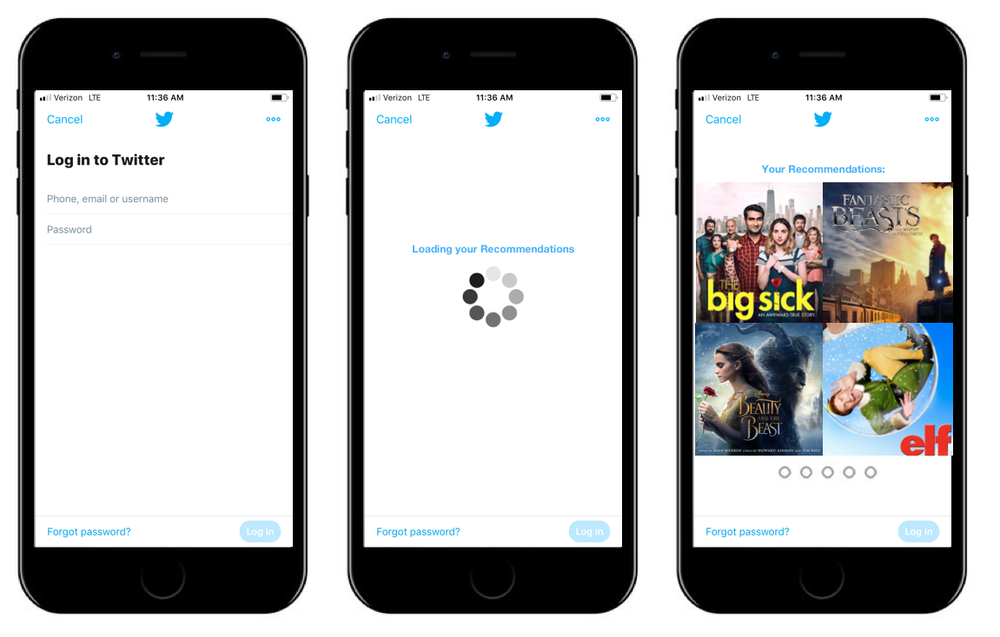
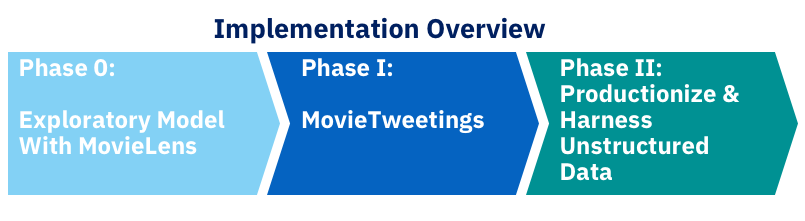

# MovieTweetings ALS Collaborative Filtering 
##  Business Objective: Increase Recommendation Accuracy for our active Twitter Users

Our users will be able to log into Twitter where their previous movie ratings will provide the basis for new movie recommendations to be made. This objective will be accomplished by exploiting the relationships between users and between movies. We will further addres the problem of when users have not rated a sufficient amount of movies by implementing an average based solution, so these users, too, will have recommendations avaliable to them. 

# Dataset:

[MovieTweetings](https://github.com/sidooms/MovieTweetings) is a dataset obtained by scraping Twitter for well-structured tweets for movie ratings of the form similar to the following:
"I rated The Matrix 9/10 http://www.imdb.com/title/tt0133093/ #IMDb"
According to the documentation, “On a daily basis the Twitter API is queried for the term ‘I rated #IMDb’.”

## users.dat
Contains the mapping of the users ids on their true Twitter id in the following format: userid::twitter_id. 

## ratings.dat
Contains the extracted ratings are stored in the following format: user_id::movie_id::rating::rating_timestamp.

## movies. dat
Contains the movies that were rated in the tweets followed by the year of release and associated genres in the following format: movie_id::movie_title (movie_year)::genre|genre|genre.

# Model Selection Criteria:
We aim to minimize RMSE while providing a minimized computation time to provide the most accurate recommendations as fast as possible. This tradeoff will be qualitatively considered as well as with quanifiable metrics including RMSE and a modified version of recall -- 

# Methodology:

Primary exploratory data analysis and visualization will be done to explore the dataset at hand.

We will be undertaking a Spark implementation of ALS (Alternating Least Squares) with implicit feedback and explicit numerical ratings models taken into consideration. Implicit feedback will be of the form like versus dislike based on a threshold of a rating of 5. 

The assumptions underlying the implicit feedback model is that an individual may exhibit voluntary response bias, only rating and subsequently tweeting when they strongly feel a certain way about
a movie though then the numerical rating may be arbitrary.  Namely this can be thought of as a user will tweet their rating about a movie when they love the movie or hate it. Further a priori to their rating, the user may have felt that they would enjoy they movie, which is why they watched it. Taking into account these factors, the implicit feedback model is considered. 

The explicit model will take the explicit ratings from the scraped tweets into account. 

Based on the resulting metrics of the two models and their computational complexity, a model will be chosen and hyperparameters will be tuned via grid search. 

Finally, the model will then be extended to predict the top 3 New movies for a user. The definition of new movie will be the top three newest movies with high prediction or rating value for a respective user which may be a movie that is over one year old. 

## File descriptions:
MovieTweetings ALS.ipynb : The implementation of the methodology above is contained in this notebook

requirements: Contains information on all software/package requirements to run the code

# Implementations:

In Phase 0, we created a [GraphLab implementation of a collaborative filtering based recommender](https://github.com/xenaritu/Personalisation)  on the widely used and studied MovieLens dataset. However, we were not  comfortable operationalizing this as the scale of the dataset is minute compared to the scale of data that the business would be requiring in order to provide customers with the best and most informed decisions. Further, the algorithm itself was not scalable. Potential watch outs would be that the dataset in use is overfitting to the small dataset and, thus, would not provide the optimal recommendations given the larger dataset size. Another goal was to provide novel recommendations to users which was not adequately addressed in this model. 

In Phase I, the MovieTweetings dataset provided a mechanism for a regularly updated source of ratings which is obtained by scraping Twitter for well-structured tweets. By analyzing the differences between implicit feedback and explicit ratings it was found that the implicit feedback model was able to capture user preferences without explicit ratings as approximately 75% of the true top 3 ratings were captured by the model. This supported the intuition that the sharing of a tweet in regards to a movie provided insight into the opinion of the user itself. Namely, there was likely a strong response to the movie that was compelling enough to share the tweet via Twitter. Further, the total MovieTweetings dataset showed that over 70% of the tweets were high ratings which supported this assumption.  
Then an explicit model taking into account explicit ratings was trained, tuned, and analyzed. An approximately 10% improvement was obtained compared to a baseline model that always returns the mean rating. 
Finally, to capture novelty and drive revenue growth through partnering with cinema chains, we constrained the recommendations to only new movies. There was an approximately 70% improvement when compared to a naïve model that uses the mean to recommend the top 3 newest movies for a user. 

The next steps will be in Phase II which will be a two part venture. First we will productionize the new movie recommendation model from Phase I as it is scalable, drives revenue growth, and is able recommend movies with great improvement from the naïve model. Simultaneously while the production level implementations are done,  we will begin an endeavor to scrape Twitter for unstructured tweets that contain information about movies to augment our current dataset. This will potentially allow us to drive accuracy of new movie predictions as new movies are often scarcely rated in a structured manner especially directly after release, though many individuals may tweet their opinions in regards to new movies. Potential fallbacks would include the classification of these tweets into pseudo-ratings as well as “Twitter lingo” or shorthand abbreviations being used that a potential NLU model may not be able to decipher.  

# Sources:
Collaborative Filtering for Implicit Feedback Datasets by Yifan Hu, Yehuda Koren and Chris Volinsky

Introduction to Statistical Machine Learning by Sugiyama, Masashi

IBM Data Science Experience

Recommender Systems by Aggarwal, Charu C.

